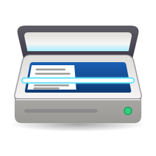
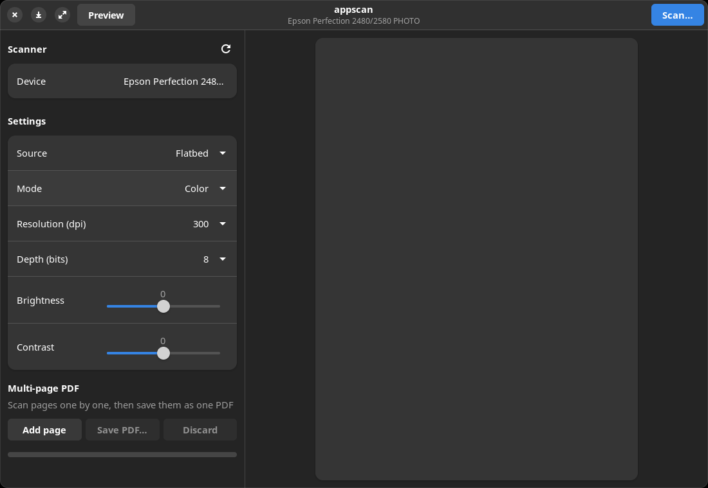

<p align="center"></p>

<h1 align="center">appscan</h1>

<p align="center">Scan documents and photos on Linux, from a GNOME app or the command line.</p>

<p align="center">
  <a href="https://github.com/matteospanio/appscan/actions/workflows/ci.yml"></a>
  <a href="https://github.com/matteospanio/appscan/releases/latest"></a>
  <a href="LICENSE"></a>
  
</p>

appscan is a small GTK4/libadwaita app and CLI for any scanner SANE supports. It started as
a way to keep an old Epson Perfection 2480 PHOTO working on a modern desktop, so it also
handles the awkward parts some models need: firmware uploads, lamp warm-up and scans that
hang. Scanning needs no root and no edits to `/etc/sane.d`.

<p align="center"></p>

## Features

- 🖥️ **GNOME-style GUI**: pick a scanner, source, mode, resolution, depth, brightness and
  contrast; preview the bed and drag to select an area.
- ⌨️ **Scriptable CLI**: `appscan scan out.png` with the same settings, plus `--area` in
  millimetres and `--pages N` for multi-page PDFs.
- 🎛️ **Options from your scanner**: the values and ranges you can choose are read from the
  selected device (`scanimage -A`); invalid values are rejected before scanning.
- 📄 **Formats**: PNG, JPEG, TIFF, PNM and PDF. Each PDF page is encoded on its own: colour and
  grey pages as JPEG, Lineart pages as lossless 1-bit, and each page sized from its own
  resolution, so one PDF can mix pages scanned at different settings.
- 📚 **Multi-page PDF**: add pages one by one in the GUI, or with `--pages N` on the command
  line; stopping early or a failing page still saves the pages already scanned.
- 🛟 **Recoverable hangs**: a scan that won't cancel is killed, and scanners with a profile
  are reset over USB instead of being replugged (`appscan reset` does it on demand).
- 🔌 **Quirk profiles**: models that need firmware, a warm-up or careful cancelling get a small
  built-in profile (the Epson 2480/2580 is the first).

## Supported hardware

| Model | USB ID | SANE backend | Status |
|---|---|---|---|
| Epson Perfection 2480 PHOTO | `04b8:0121` | `snapscan` | Tested (needs firmware) |
| Epson Perfection 2580 PHOTO | `04b8:0121` | `snapscan` | Untested; same USB ID and firmware as the 2480, SANE reports its film unit unsupported |
| Any other SANE-supported scanner | — | any | Generic support, untested |

Got another model working, or need a quirk for it? See [Adding hardware](#adding-hardware).

## Installation

```sh
curl -fsSL https://raw.githubusercontent.com/matteospanio/appscan/main/install.sh | bash
```

The script:

- installs the missing runtime packages with `apt` (`sane-utils curl p7zip-full cabextract
  libgtk-4-1 libadwaita-1-0`);
- downloads the prebuilt binary for your architecture (x86_64 or aarch64) from the latest
  [GitHub release](https://github.com/matteospanio/appscan/releases) into `~/.local/bin`, or
  builds it with `cargo` if no binary fits;
- runs `appscan setup` (desktop entry, icon and man page under `~/.local/share`);
- runs `appscan firmware` to fetch the Epson 2480/2580 firmware, unless it is already installed
  (only those scanners need it; set `APPSCAN_SKIP_FIRMWARE=1` to skip it, and see the
  firmware notice below).

The prebuilt binary needs glibc 2.35, GTK 4.6 and libadwaita 1.1 or newer (Ubuntu 22.04,
Debian 12, Fedora 36 or later). The script installs packages only with `apt`; on other
distributions install the equivalent packages first.

A specific version:

```sh
curl -fsSL https://raw.githubusercontent.com/matteospanio/appscan/main/install.sh | APPSCAN_VERSION=0.2.0 bash
```

Uninstall (removes the binary, the desktop entry, icon, man page and `~/.local/share/appscan`):

```sh
curl -fsSL https://raw.githubusercontent.com/matteospanio/appscan/main/install.sh | bash -s -- --uninstall
```

### From source

```sh
sudo apt install libgtk-4-dev libadwaita-1-dev pkg-config build-essential \
    sane-utils curl p7zip-full cabextract
cargo install --locked --git https://github.com/matteospanio/appscan   # Rust 1.90 or newer
appscan setup      # desktop entry, icon, man page
appscan firmware   # only for the Epson 2480/2580
```

## Usage

Run `appscan` or open it from the applications menu. Pick a scanner, press **Preview**, drag
over the preview to select an area and press **Scan…**; the file extension chooses the
format. Use **Add page** and **Save PDF…** to build a multi-page PDF.

From the command line:

```sh
appscan list                                          # NAME<TAB>description of each scanner
appscan scan letter.png                               # scanner defaults, whole bed
appscan scan -d 'snapscan:libusb:001:011' page.png    # a specific scanner
appscan scan --mode Gray -r 200 --pages 4 contract.pdf   # Enter between pages
appscan scan -r 600 --area 20 30 150 100 photo.jpg    # LEFT TOP WIDTH HEIGHT in mm
appscan scan --brightness 30 --contrast 40 faded.png
appscan warmup                                        # warm the lamp before a batch
appscan reset                                         # revive a scanner that stopped answering
```

Without `-d`, appscan uses the first scanner `appscan list` prints. Settings the current mode
doesn't use (for example brightness in Lineart on the Epson) are ignored. The full reference,
with more examples, is in the man page:

```sh
man appscan
```

## How it works

- Every scan runs SANE's [`scanimage`](http://www.sane-project.org/man/scanimage.1.html) as a
  subprocess, and the available options come from parsing `scanimage -A` for the selected
  scanner.
- Why a subprocess: some backends hang inside libsane. A separate process can be killed, and
  a USB reset then brings the scanner back, so a hang costs a lamp warm-up instead of a
  replug. An in-process library call can't be interrupted that way.
- A **quirk profile** matches a scanner by SANE backend and USB ID. It gives appscan a private
  SANE config (only that backend, so listing is fast), the firmware to install, whether the
  lamp needs a warm-up (the GUI starts one at launch), and whether cancelling before image
  data flows wedges the device (then appscan kills `scanimage` and resets USB).
- Scanners without a profile use your system SANE config as-is.

## Adding hardware

1. Capture your scanner's options:
   ```sh
   scanimage -L
   scanimage -d 'backend:device' -A > my-scanner.txt
   ```
   If the scanner has more than one source or mode, capturing `-A` with `--source`/`--mode`
   set helps too.
2. If it works as a generic scanner, you're done: open an issue or PR to add it to the table.
3. If it needs quirks, add a `Profile` entry to `PROFILES` in [`src/profile.rs`](src/profile.rs)
   with its USB ID, SANE backend, backend `.conf` contents, `firmware` (or `None`), `warmup`
   and `early_cancel_wedges`.
4. Save the `-A` capture under [`tests/fixtures/`](tests/fixtures) and add a parser test for it
   in `src/sane.rs`.
5. Open a pull request with what you tested.

## ⚠️ Proprietary firmware

> [!WARNING]
> The Epson Perfection 2480/2580 firmware (`esfw41.bin`) is proprietary software
> © Seiko Epson Corporation.
>
> - appscan does **not** include or redistribute it.
> - It is downloaded from Epson's own server (`ftp.epson.com`, inside the Epson Scan driver
>   for Windows) only when `appscan firmware` runs, which the install script does unless
>   `APPSCAN_SKIP_FIRMWARE=1` is set. It is then extracted and SHA-256 verified locally.
> - It is intended only for use with an Epson scanner you own. You are responsible for
>   complying with Epson's license terms; appscan's MIT license does not cover it.
> - appscan is not affiliated with, authorized by or endorsed by Seiko Epson Corporation.
>   Epson, Perfection and other product names are trademarks of their respective owners.

## Development

```sh
sudo apt install libgtk-4-dev libadwaita-1-dev pkg-config build-essential sane-utils
cargo build
cargo test
cargo clippy --all-targets -- -D warnings
cargo run -- scan test.png -r 150
```

## License

[MIT](LICENSE) © 2026 Matteo Spanio

This software is based in part on the work of the Independent JPEG Group (JPEG encoding via
the [jpeg-encoder](https://crates.io/crates/jpeg-encoder) crate).
